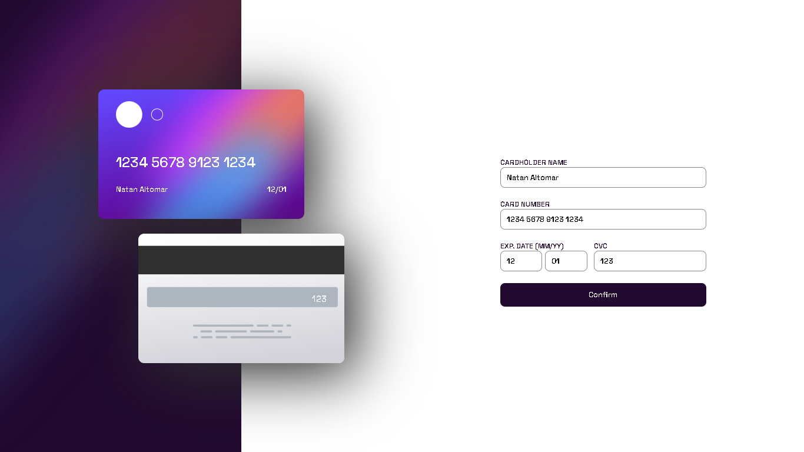
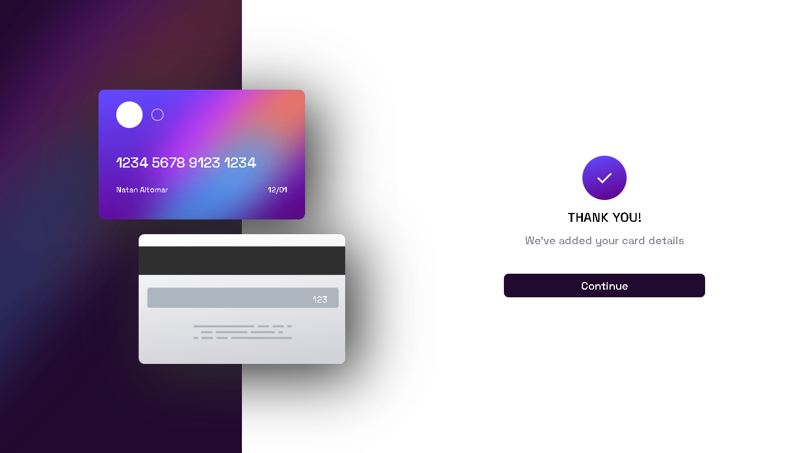
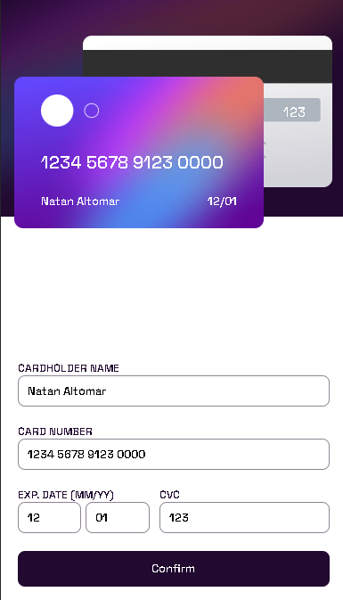

# Frontend Mentor - Product preview card component solution

Esta é uma solução para [Interactive card details form challenge on Frontend Mentor](https://www.frontendmentor.io/challenges/interactive-card-details-form-XpS8cKZDWw). Frontend Mentor challenges ajuda a melhorar suas habilidades e skills.

# Rodar o projeto

## Em seu console use:

### `npm install` para instalar as dependências.

### `npm start` para iniciar o projeto.

### logo após, o projeto iniciara no caminho https://localhost:3000

## Conteúdo

- [Geral](#geral)
  - [Desafio](#o-desafio)
  - [Screenshot](#screenshot)
  - [Links](#links)
  - [Construido com](#Construido-com)
- [Autor](#author)

## Geral

### O desafio
 O usuário terá a possibilidade de:

- Vizualizar um layout otimizado e com auto-ajustamento para diferentes dispositivos.
- Vizualizar hover e focus states em elemento interativos
- Vizualizar a movimentação interativa e modificação do cartão

### Screenshot

### Links

- Live project: [vizualizar projeto](https://notifications-page-s827-fbmwa377b-natanalpe.vercel.app/)

### Construido com

- React Js
  - React Hooks
  - Vanilla Tilti Library
- CSS custom properties
  - Flexbox
  - Grid
  - Media Query
  - Styled Components

## Autor

- Github - [@Natanalpe](https://github.com/natanalpe)
- Frontend Mentor - [@Natanalpe](https://www.frontendmentor.io/profile/Natanalpe)
- Codepen - [@Natanalpe](https://codepen.io/natanalpe)
- Linkedin - [Natan Altomar Pereira](https://www.linkedin.com/in/natanalpe14/)

