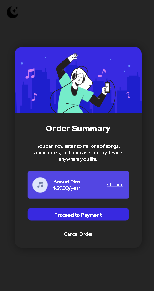

# Frontend Mentor - Product preview card component solution

This is a solution to the [Order summary component challenge on Frontend Mentor](https://www.frontendmentor.io/challenges/order-summary-component-QlPmajDUj). Frontend Mentor challenges help you improve your coding skills by building realistic projects. 

## Conteúdo

- [Geral](#geral)
  - [Desafio](#o-desafio)
  - [Screenshot](#screenshot)
  - [Links](#links)
  - [Construido com](#construido-com)
  - [Testado com](#testes)
- [Autor](#autor)

## Geral

### O desafio
 O usuário terá a possibilidade de:

- Vizualizar um layout otimizado e com auto-ajustamento para diferentes dispositivos.
- Vizualizar hover e focus states em elemento interativos
- Escolher entre os temas noturno e diurno

### Screenshot

### Links

- Live project: [vizualizar projeto](https://brilliant-speculoos-4369c9.netlify.app/)

### Construido com

- Semantic HTML5 markup

- CSS custom properties
  - Flexbox
  - Grid
  
- Javascript

### Testes

- Testado com PageSpeed Insights: [Vizualizar insights](https://pagespeed.web.dev/report?url=https%3A%2F%2Fbrilliant-speculoos-4369c9.netlify.app%2F)

## Autor

- Github - [@Natanalpe](https://github.com/natanalpe)
- Frontend Mentor - [@Natanalpe](https://www.frontendmentor.io/profile/Natanalpe)
- Codepen - [@Natanalpe](https://codepen.io/natanalpe)
- Linkedin - [Natan Altomar Pereira](https://www.linkedin.com/in/natanalpe14/)
