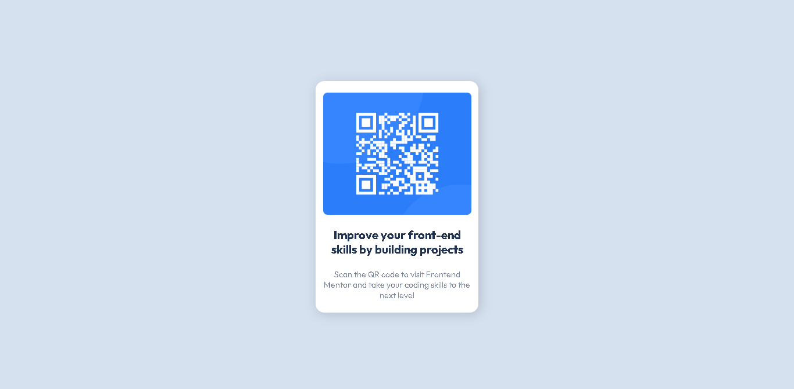
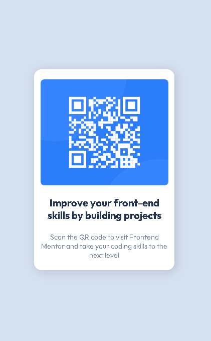

# Frontend Mentor - QR Code component solution

This is a solution to the [QR Code component challenge on Frontend Mentor](https://www.frontendmentor.io/challenges/qr-code-component-iux_sIO_H). Frontend Mentor challenges help you improve your coding skills by building realistic projects. 

## Conteúdo

- [Geral](#geral)
  - [Desafio](#o-desafio)
  - [Screenshot](#screenshot)
  - [Links](#links)
  - [Construido com](#Construido-com)
- [Autor](#author)

## Geral

### Screenshot

### Links

- Live project: [vizualizar projeto](https://amazing-caramel-180b38.netlify.app/)

### Construido com

- Semantic HTML5 markup
- CSS custom properties
  - Flexbox

## Autor

- Github - [@Natanalpe](https://github.com/natanalpe)
- Frontend Mentor - [@Natanalpe](https://www.frontendmentor.io/profile/Natanalpe)
- Codepen - [@Natanalpe](https://codepen.io/natanalpe)
- Linkedin - [Natan Altomar Pereira](https://www.linkedin.com/in/natanalpe14/)
